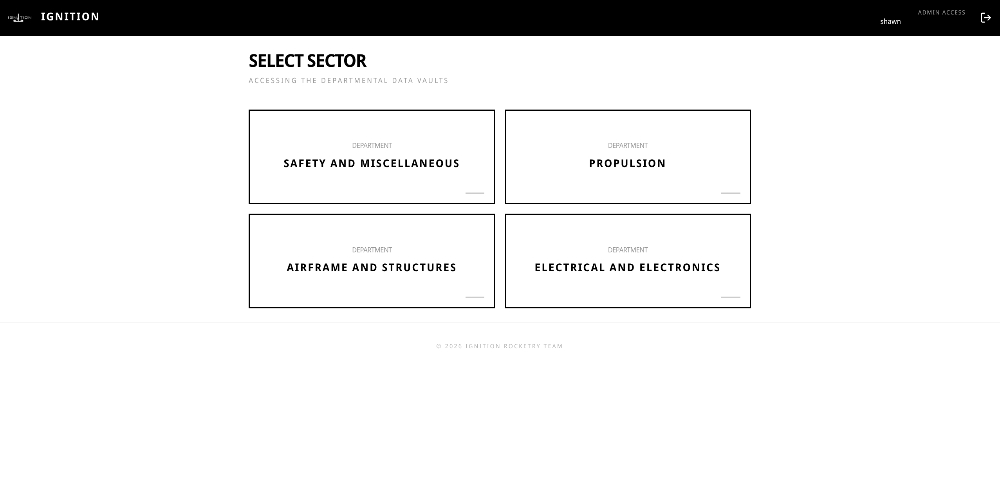
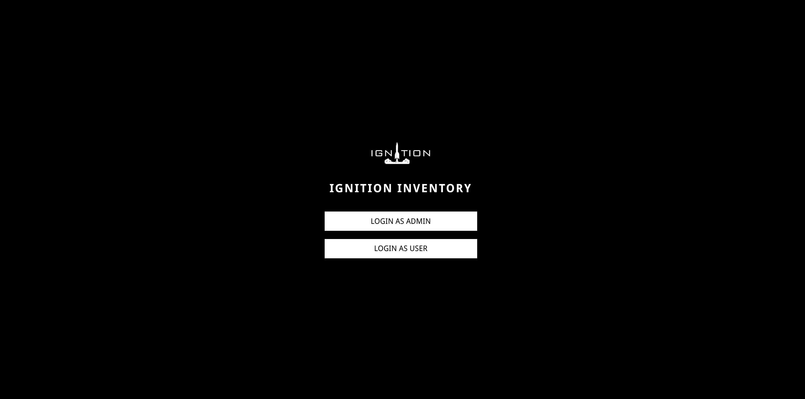
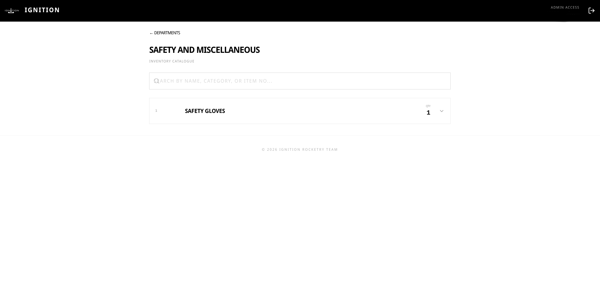

# 🚀 Ignition Inventory Manager

A fast, minimal, and professional inventory management system built specifically for the **Team Ignition**. This application is designed to handle departmental hardware and electronics with precision, speed, and a high-contrast aesthetic.

## Features

- **Fast-Load Architecture**: Sessions are restored instantly. No waiting for database checks before you see your data.
- **Minimal Design**: A high-contrast Black & White aesthetic focused on readability and professional UX.
- **Role-Based Access**: 
  - **Admins**: Full visibility + ability to update quantities and item details.
  - **Users**: Read-only access to browse and search inventory.
- **Department Isolation**: Browse inventory by sector (Safety, Propulsion, Airframe, Electrical).
- **Smart Search**: Debounced, client-side filtering for near-instant results across 100+ items.
- **Mobile First**: Fully responsive design for use on the workshop floor or in the field.

## Workflow

### 1. Secure Authentication
The app features a unique dual-mode login screen. Admins use a dedicated entry point to prevent unauthorized signups, while standard team members can register and log in normally.

### 2. Department Selection
Once authenticated, users select their specific sector. This keeps the workspace focused and minimizes data overhead.

### 3. Inventory Management
Items are displayed in a clean list format showing essential metrics (Item ID, Name, Quantity). Clicking an item reveals deep technical details (Location, Status, Category) without triggering extra API calls.

## 🏗️ Technology Stack

- **Frontend**: React 19 + Vite
- **Styling**: Tailwind CSS v4
- **Backend/Auth**: Supabase
- **Icons**: Lucide React

## Getting Started

1. Clone the repository.
2. Install dependencies: `npm install`.
3. Set up your `.env` with `VITE_SUPABASE_URL` and `VITE_SUPABASE_PUBLISHABLE_KEY`.
4. Run locally: `npm run dev`.

*Built with precision for Team Ignition.*
